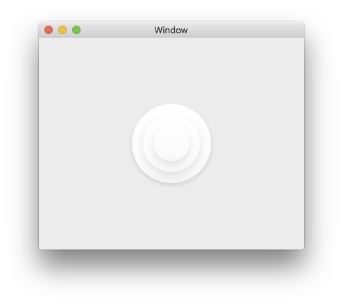

# CircleTriadView [](https://github.com/Carthage/Carthage)

A NSView subclass that renders a triad of circles.

This is what the CircleTriadView looks like by default:



Most things about the view are configurable directly in Interface Builder: the fill gradient, shadowing, inset from the view's frame, etc. 

#### INSTALLATION

CircleTriadView is easiest used via the [Carthage](https://github.com/Carthage/Carthage) dependency manager.

The CircleTriadView was originally created with the amazing [PaintCode](http://www.paintcodeapp.com) and some extra dynamic configurability added afterwards.

##### Carthage

[Carthage](https://github.com/Carthage/Carthage) is a decentralized dependency manager that builds your dependencies and provides you with binary frameworks.

You can install Carthage with [Homebrew](http://brew.sh/) using the following command:

```bash
$ brew update
$ brew install carthage
```

To integrate CircleTriadView into your Xcode project using Carthage, specify it in your `Cartfile`:

```ogdl
github "mz2/CircleTriadView" ~> 0.0.1
```

Run `carthage update` to build the framework and drag the built `CircleTriadView.framework` into your Xcode project.

### Manually

If you prefer not to use either of the aforementioned dependency managers, you can integrate CircleTriadView into your project manually.

#### Embedded Framework

- Open up Terminal, `cd` into your top-level project directory, and run the following command "if" your project is not initialized as a git repository:

```bash
$ git init
```

- Add CircleTriadView as a git [submodule](http://git-scm.com/docs/git-submodule) by running the following command:

```bash
$ git submodule add https://github.com/mz2/CircleTriadView.git
```

- Open the new `CircleTriadView` folder, and drag the `CircleTriadView.xcodeproj` into the Project Navigator of your application's Xcode project.

    > It should appear nested underneath your application's blue project icon. Whether it is above or below all the other Xcode groups does not matter.

- Select the `CircleTriadView.xcodeproj` in the Project Navigator and verify the deployment target matches that of your application target.
- Next, select your application project in the Project Navigator (blue project icon) to navigate to the target configuration window and select the application target under the "Targets" heading in the sidebar.
- In the tab bar at the top of that window, open the "General" panel.
- Click on the `+` button under the "Embedded Binaries" section.
- Select the `CircleTriadView.xcodeproj` nested inside a `Products` folder now visible.

> The `CircleTriadView.framework` is automagically added as a target dependency, linked framework and embedded framework in a copy files build phase which is all you need to build on the simulator and a device.

(This manual installation section was shamelessly ripped from the excellent [Alamofire](github.com/alamofire/Alamofire) instructions.)

#### USAGE

- Create a custom view in Interface Builder.
- Set its class to "CircleTriadView".
- Set its module to "CircleTriadView".

Following these steps, the view will also get rendered in Interface Builder and you can change many of its configurable parameters directly there.

Take a look at the example CircleTriadViewExample project to see an example use of CircleTriadView using Interface Builder.

**NOTE!** The view's frame should be square.